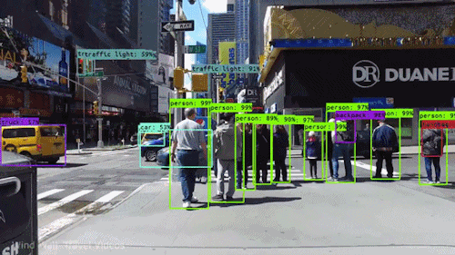

## About Me

Hi, my name is Yucai Bai. I’m an algorithm engineer at Noah Ark Computer Vision Lab in HUAWEI, and I still focus on the project and technology of self-driving vehicles. I believe L5-level intelligent vehicles will change our lives one day. Before that, we can do a lot. 

In my opinion, the key technology to L5 is simulation technology, where we can collect abundant corner-case data to solve long-tailed problems. And the simulation also plays a key role in the test environment, which is the last chance to save people. 

So I want to find a PhD/Work opportunity about simulation.

## Education
### Sichuan University ( 2017.9 - 2020.8 )
[Tiansi Lab](http://tiansilab.org/en/index.jsp), College of  Computer Science  
Master of Engineering, received in 2020.8  
Major in Software Engineering  
Supervised under [Prof. Yi-Fei Pu](https://ieeexplore.ieee.org/author/37269178400)   
GPA: 3.20 / 4.0  

### Chongqing University of Posts and Telecommunications ( 2013.9 - 2017.6 )
School of Software Engineering  
Bachelor of Engineering, received in 2017.6    
Major in Software Engineering    
GPA: 3.28 / 4.0  

## Research Interests
- Simulation／Nerf
- Transfer Learning and Multi-Task Learning
- Extreme Low-Resolution Action Recognition   
- Semantic 3D Map

## Publications
1. __Yucai Bai__, Qin Zou, et al. __Extremely Low Resolution Action Recognition with Confident Spatial-Temporal Attention Transfer__, under review by __IJCV__. Before that, accepted then rejected by __TIP__. [\[PDF\]](https://arxiv.org/pdf/1909.03580.pdf)
2. __Yucai Bai__, Lei Fan, et al. __Monocular Outdoor Semantic Mapping with a Multi-task Network__, accepted by __IROS2019__ [\[PDF\]](https://arxiv.org/abs/1901.05807)[\[VIDEO\]](https://www.youtube.com/watch?v=PuVFtVPx3MQ)[\[CODE\]](https://github.com/RaymondByc/segm_depth_network)
3. __Yucai Bai__, Sen Zhang, Miao Chen, et al. __A Fractional Total Variational CNN Approach for SAR Image Despeckling__, accepted by __ICIC2018__ [\[PDF\]](https://link.springer.com/chapter/10.1007/978-3-319-95957-3_46)[\[CODE\]](https://github.com/RaymondByc/FID-CNN)
4. Miao Chen, Yi-Fei Pu, __Yu-Cai Bai__, __Low-Dose CT Image Denosing Using Residual Convolutional Network with Fractional TV Loss__, accepted by __Neurocomputing__ [\[PDF\]](https://www.sciencedirect.com/science/article/abs/pii/S0925231220314995)

## Experiences

### Auto Labelling  (2022.1 - 2022.8)

In this project, we can use the off-board data to detect more accurately. The unlimited model size and whole video information are allowed to use. The metric is more serious than real-time detection, iou0.8 mAP and iou0.9 mAP.

I am responsible for multi-modal (lidar+camera) detection and tracking. For the detection, we concatenate the extracted image feature with the point before convolution. Our experiment shows that the multi-modal model has dramatic improvement for the target with the sparse-point target. For the tracking, extra image information boosts the performance of the instance matching process, which helps us enlarge the matching range.  
### Advanced Driver Assistance Systems (ADAS) (2021.3 - 2021.12)

ADAS is an L2-level project of self-driving. Its perception part requires multi-class object detection based on forward-view images, including vehicles, pedestrians, traffic signs, obstacles.    

I am responsible for:
- the optimization of specific categories.
- the improvement of training speed 
    - reducing communication time between machines
    - framework (MMDetction) optimization
- the improvement of representation ability (with the assistance of the related task, e.g. semantic segmentation).

### Local Automated Parking Assist (LAPA) (2020.9-2021.2)

LAPA is an L4-level project to help driver park their vehicle more conveniently. 
To be specific, the car with LAPA could __park itself in the selected/saved parking slot__.
The perception part is divided into two stages. The first stage is to map and save key information by SLAM system, such as trajectory and key objects.
 The second stage is to locate, including selecting the saved parking slot and constantly providing distance.   

I am responsible for __parking slot detection__ on the bird-eye images and the development of related functions (parking slot selection and related post processing).
 The difficulties involved are: strong light reflection on ground, the missing of key visual features, the fluctuation of detection results.

I also filed a __patent__ for better detection in the environment with uncompleted visual features, which is in the review.  

### Extreme Low Resolution Action Recognition (2019.5 - 2021.2)

In order to solve the problem --  people in the corners is very small and just contains limited pixels, we proposed a new method to recognize extremely low-resolution activities.
which is based on Confident Spatial-Temporal Attention Transfer (CSTAT).
 
 __CSTAT can acquire information from high resolution data by reducing the attention differences with a transfer-learning strategy. Besides, the credibility of the supervisory signal is also taken into consideration for a more confident transferring process.__ Experimental results on two well-known datasets, i.e., UCF101 and HMDB51, demonstrate that, the proposed method can effectively improve the accuracy of eLR activity recognition, and achieves an accuracy of 59.23% on 12×16 videos in HMDB51, __a state-of-the-art performance__.  

__The corresponding paper is in the 2nd-round review of TIP.__

### Non-compliance Action Detection of Court Scene in Surveillance Videos  (2019.3 - 2020.6)
As the team leader, I took charge of the entire project,  including  __the design and development of a real-time detection algorithm of the non-compliance actions__ and __the production of the non-compliance action datasets__.   
The detection is divided into two stages.  Firstly, we used the __object detection algorithm__ to detect people and crop the corresponding area. 
Then we used __image-based algorithms__ to cope with the easy-to-classify categories and __3D convolution network techniques__ for more complex actions.

We won __2nd__ in the action recognition track of __Teda·Huabo cup innovation and entrepreneurship challenge__

### 3D Semantic Reconstruction from a Monocular Camera with a Novel Multi-task Network (2018.8 - 2019.2)

This work was performed when I visited [Institute of Unmanned Systems @SYSU](https://www.usilab.cn/) as a summer research intern, under the supervision of [Prof.Chen](http://carlib.net/).   

We explored the interplay between low-level features for both depth and semantic prediction. The proposed network can produce __the depth and semantic maps simultaneously__, which provides basic knowledge for further semantic map reconstruction. We apply __image segmentation techniques__ to __refine the depth prediction__ to reduce the fluctuations caused by convolution layers. The final map is saved in __a memory-friendly way__ to present a large-scale urban scene.  

__The corresponding paper is accepted by IROS 2019.__   

### Image Despeckling with Fractional Total Variational Loss (2017.11 - 2018.5)
Motivated by the __Applications in Fractional Calculus__ Course, we applied fractional-calculus techniques in the image denoising task. Due to its advantages, __long-term memory, non-locality and weak singularity,__ the fractional-differential result of images can preserve __the low-frequency feature in the smooth area such as contours, 
and at the same time,  keep high-frequency information such as textures.__  

We proposed __FID-CNN__, a 8-layer CNN network with fractional total variational loss. 
Ablation experiments shows the proposed method has a better performance in preserving details .
 
__The paper is accepted by ICIC2018.__ 

We also transferred the main ideas to low-dose CT images and modified our method to make it more suitable for its characteristics. __The paper is accepted by Neurocomputing.__

### [ZBJ.COM](https://zbj.com) Inc.   Front-End Engineer Intern (2015.9 - 2016.2)

Worked in Basic Technology Department.

- Developed web sites [Bajie Account](https://cs.zbj.com), [Bajie City](https://city.zbj.com) pages 
- Updated image format (jpg/png -> webp).           

---

## Honors
- Second Prize Merit-based Scholarship, SCU 2019.7
- Second Prize, 6th Teda · Huabo Cup, Action Recognition Track, 2019.6
- Excellent Postgraduate Student, SCU 2018.9 
- Excellent Graduation Thesis, CQUPT 2017.6
- Third Prize Merit-based Scholarship, CQUPT 2015.9

## Technical Strengths
Deep learning framework: Pytorch (MMDetection, det3d) > Tensorflow > Caffe    
Coding language: Python, C++, JavaScript

## English Language Level
IELTS: 6.5 (working on it !!!)     
CET6