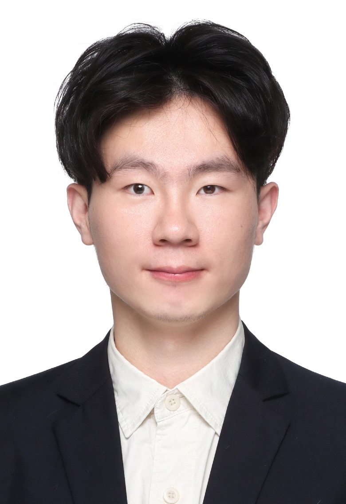
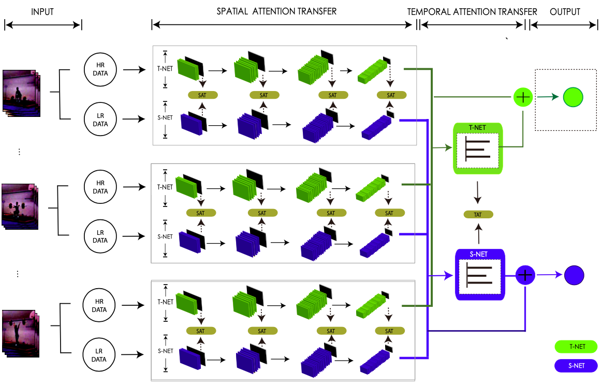

## About Me

Hi! I am working on HUAWEI company now! I still focus on the exciting field - Self Driving Cars and I have no doubts about its future prosperity. 

Specifically, I am involved in the Autonomous Valet Parking(AVP) with four surrounding cameras. I am responsible for the parking slot detection with bird-eye images, and the aid of localization with the related information with parking slot.   

We are in the hard but right way.

## Education
### Sichuan University ( 2017.9 - 2020.6 )
[Tiansi Lab](http://tiansilab.org/en/index.jsp), College of  Computer Science  
Master of Engineering, expected in 2020.6   
Major in Software Engineering  
Supervised under [Prof. Yi-Fei Pu](https://ieeexplore.ieee.org/author/37269178400)   
GPA: 3.20 / 4.0  

### Chongqing University of Posts and Telecommunications ( 2013.9 - 2017.6 )
School of Software Engineering  
Bachelor of Engineering, received in 2017.6    
Major in Software Engineering    
GPA: 3.28 / 4.0  

## Research Interests
- Extreme Low-Resolution Action Recognition   
- Semantic 3D Map
- Multi Learning and Transfer Learning 
- Robots Vision (Active Vision)

## Publications
1. __Yucai Bai__, Qiang Dai, Long Chen*, et al. __Extremely Low Resolution Action Recognition with Spatial-Temporal Attention Transfer__, submitted to __IJCV__ [\[PDF\]](https://arxiv.org/pdf/1909.03580.pdf)
2. __Yucai Bai__, Lei Fan, et al. __Monocular Outdoor Semantic Mapping with a Multi-task Network__, accepted by __IROS2019__ [\[PDF\]](https://arxiv.org/abs/1901.05807)[\[VIDEO\]](https://www.youtube.com/watch?v=PuVFtVPx3MQ)[\[CODE\]](https://github.com/RaymondByc/segm_depth_network)
3. __Yucai Bai__, Sen Zhang, Miao Chen, et al. __A Fractional Total Variational CNN Approach for SAR Image Despeckling__, accepted by __ICIC2018__ [\[PDF\]](https://link.springer.com/chapter/10.1007/978-3-319-95957-3_46)[\[CODE\]](https://github.com/RaymondByc/FID-CNN)
4. Miao Chen, Yi-Fei Pu, __Yu-Cai Bai__, __Low-Dose CT Image Denosing Using Residual Convolutional Network with Fractional TV Loss__, accepted by __Neurocomputing__.

## Experiences

### Non-compliance Action Detection of Court Scene in Surveillance Videos  (2019.3 - Present)
As the team leader, I designed and led the entire project,  including  __a detection algorithm of the non-compliance actions in real-time__ and __the production of corresponding datasets__.   
The detection is divided into two stages.  Firstly, we use the __object detection__ algorithm to detect people and crop the corresponding area. 
Then we use the __image-based algorithm__ to process the easy-to-classify categories and __3D convolution network__ for more complex actions.

We won __2nd__ in the action recognition track of __Teda·Huabo cup innovation and entrepreneurship challenge__

### Extreme Low Resolution Action Recognition (2019.5 - Present)

In order to solve the problem that the target in the back corner of the court is too small, we proposed a new method to recognize extreme low-resolution activity.
we propose a novel Confident Spatial-Temporal Attention Transfer (CSTAT) for eLR activity recognition. __CSTAT can acquire information from high resolution data by reducing the attention differences with a transfer-learning strategy. Besides, the credibility of the supervisory signal is also taken into consideration for a more confident transferring process.__ Experimental results on two well-known datasets, i.e., UCF101 and HMDB51, demonstrate that, the proposed method can effectively improve the accuracy of eLR activity recognition, and achieves an accu- racy of 59.23% on 12×16 videos in HMDB51, __a state-of-the-art performance__.  

__The corresponding paper is submitted to IJCV.__

### 3D Semantic Reconstruction from a Monocular Camera with a Novel Multi-task Network (2018.8 - 2019.2)

This work was performed when  I studied at [Institute of Unmanned Systems @SYSU](https://www.usilab.cn/) as a summer research intern, under the supervision of [Prof.Chen](http://carlib.net/).   

We explore the interplay between low-level features for both depth and semantic prediction. The proposed network can produce __the depth and semantic maps simultaneously__, which provides basic knowledge for further semantic map reconstruction. We apply __image segmentation techniques__ to __refine the depth prediction__ to reduce the fluctuations caused by convolution layers. The final map is saved in __a memory-friendly way__ to present a large-scale urban scene.  

__The corresponding paper is accepted by IROS 2019.__   

### SAR Image Despeckling with Fractional Total Variational Loss (2017.11 - 2018.5)
Motivated in __Applications in Fractional Calculus__ Course, we tried to apply fractional calculus to image denoising.   
In terms of __long-term memory, non-locality, and weak singularity,__ fractional differential of an image can preserve __the low-frequency contour feature in the smooth area, 
and non-linearly keep high-frequency edge information and texture information.__
We proposed __FID-CNN__ with a 8 layer CNN network to feature extraction and fractional total variational loss to preserve details of image. 
Ablation experiments were carried out to demonstrate the effectiveness of the method.   

__The corresponding paper is accepted by International Conference on Intelligent Computing 2018.__ 

### [ZBJ.COM](https://zbj.com) Inc.   Front-End Engineer Intern (2015.9 - 2016.2)

Work in Basic Technology Department.

Image Format Update(from jpg/png -> webp).       
Developed web sites [Bajie Account](https://cs.zbj.com), [Bajie City](https://city.zbj.com) pages     

---

## Honors
- Second Prize Merit-based Scholarship, SCU 2019.7
- Second Prize, 6th Teda · Huabo Cup, Action Recognition Track, 2019.6
- Excellent Postgraduate Student, SCU 2018.9 
- Excellent Graduation Thesis, CQUPT 2017.6
- Third Prize Merit-based Scholarship, CQUPT 2015.9

## Technical Strengths

Python (Tensorflow > Pytorch > Caffe), JavaScript

## English Language Level

IELTS: 6.0 (working on it !!!)     
CET6